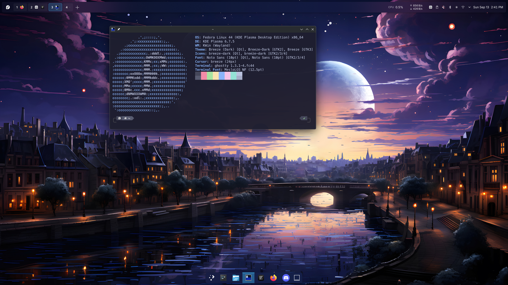
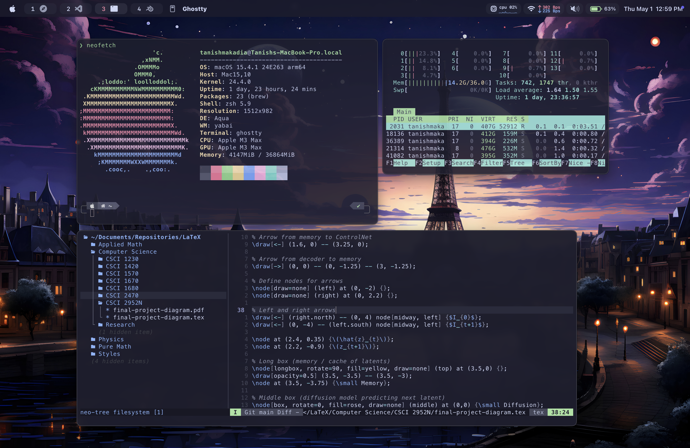

# dotfiles

## Fedora

My personal configurations for:

- [Vim](https://github.com/vim/vim)
- [Oh My Zsh](https://github.com/ohmyzsh/ohmyzsh)
- [Powerlevel10k](https://github.com/romkatv/powerlevel10k)
- [Ghostty](https://ghostty.org/)
- [KDE Plasma](https://kde.org/plasma-desktop/)
- [KWin](https://github.com/KDE/kwin)
- [Krohnkite](https://codeberg.org/anametologin/Krohnkite)
- [Workspace Bar](fedora/plasma/bar/)
- [Dock Appearance](fedora/plasma/dock/)
- [Workspace Shortcuts](fedora/kwin/shortcuts/)

See [setup instructions](fedora/README.md).

## macOS

My personal configurations for:

- [Vim](https://github.com/vim/vim)
- [Oh My Zsh](https://github.com/ohmyzsh/ohmyzsh)
- [Powerlevel10k](https://github.com/romkatv/powerlevel10k)
- [Ghostty](https://ghostty.org/)
- [Zellij](https://zellij.dev/)
- [yabai](https://github.com/koekeishiya/yabai)
- [skhd](https://github.com/koekeishiya/skhd)
- [SketchyBar](https://github.com/FelixKratz/SketchyBar)

See [setup instructions](macos/README.md).

## Shared configuration

Vim, Powerlevel10k, Ghostty defaults, and Zsh initialization live in [shared/](shared/README.md). The `fedora/` and `macos/` directories contain OS overrides and desktop configuration.
